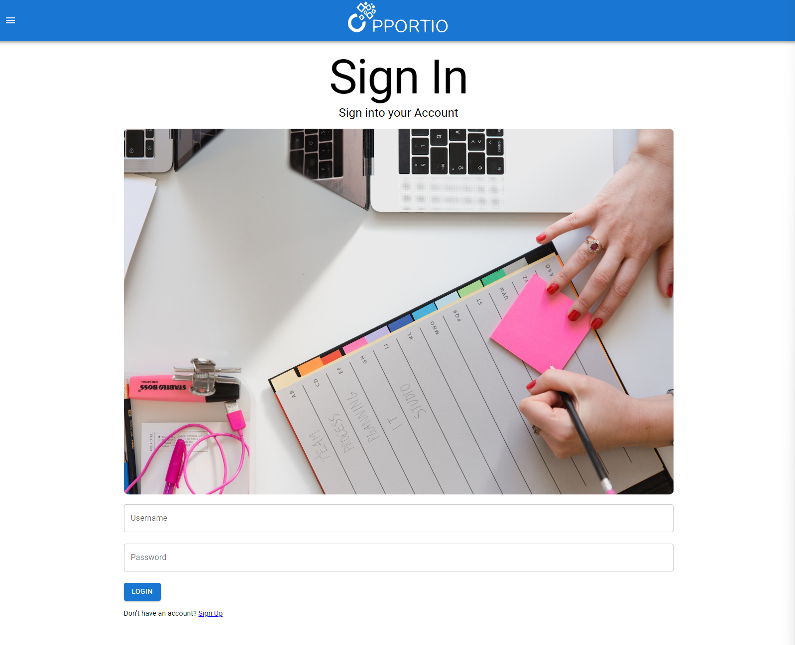
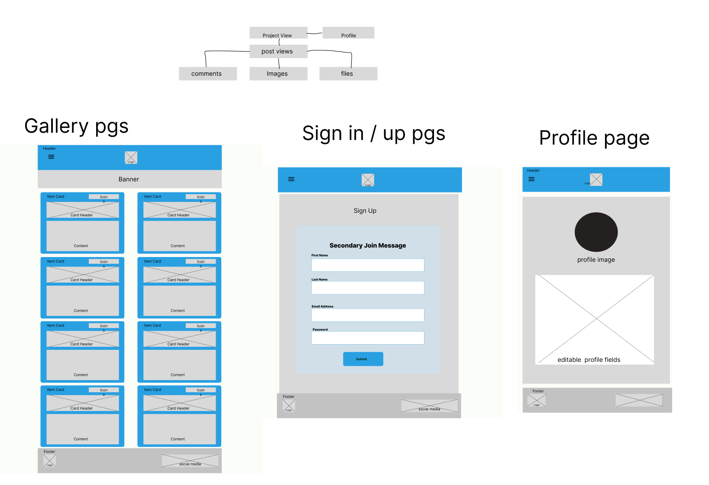
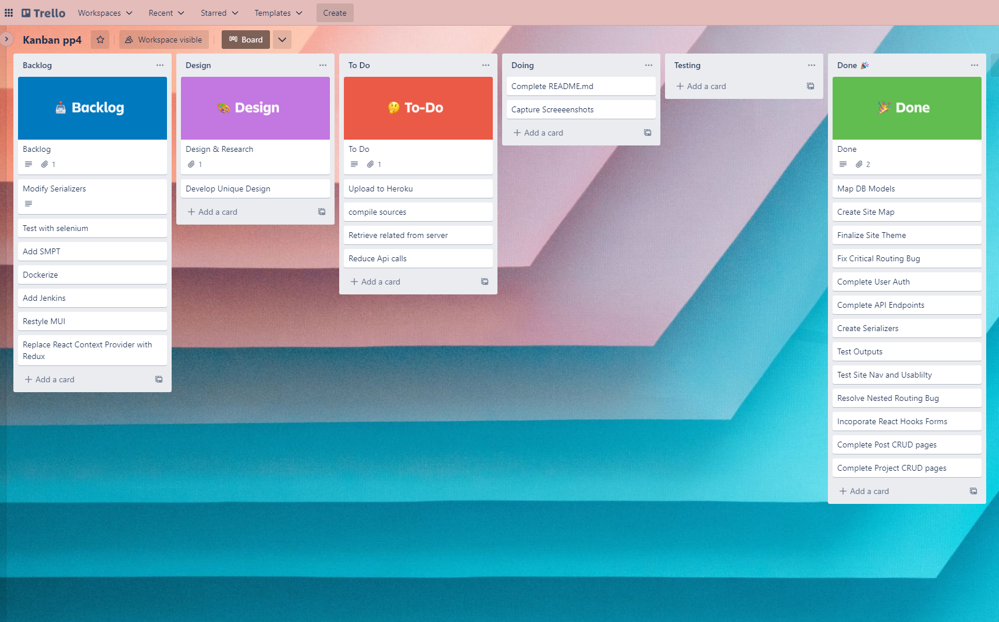
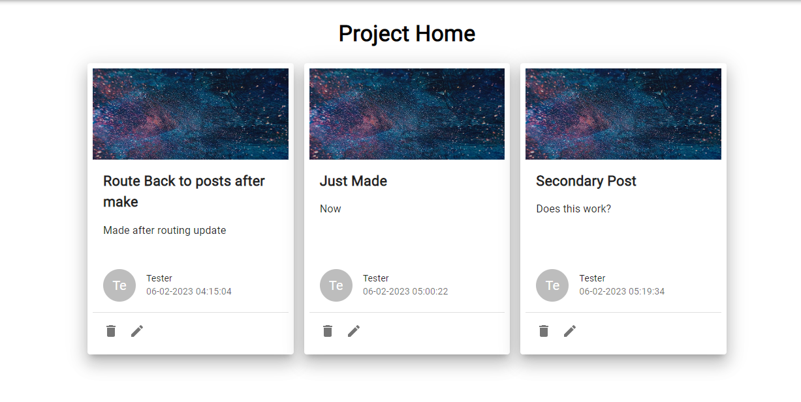
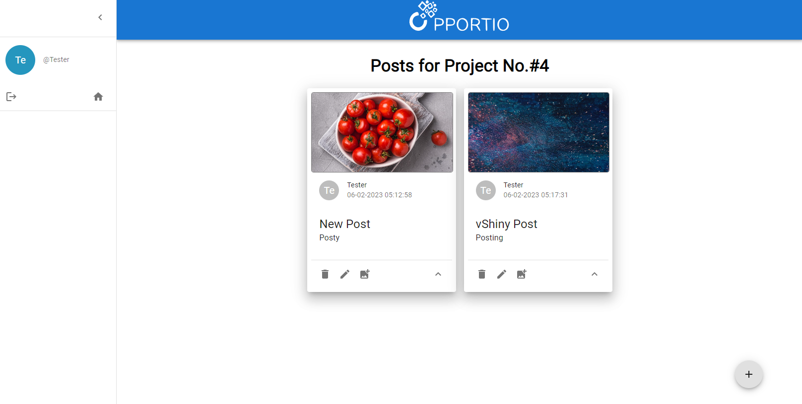
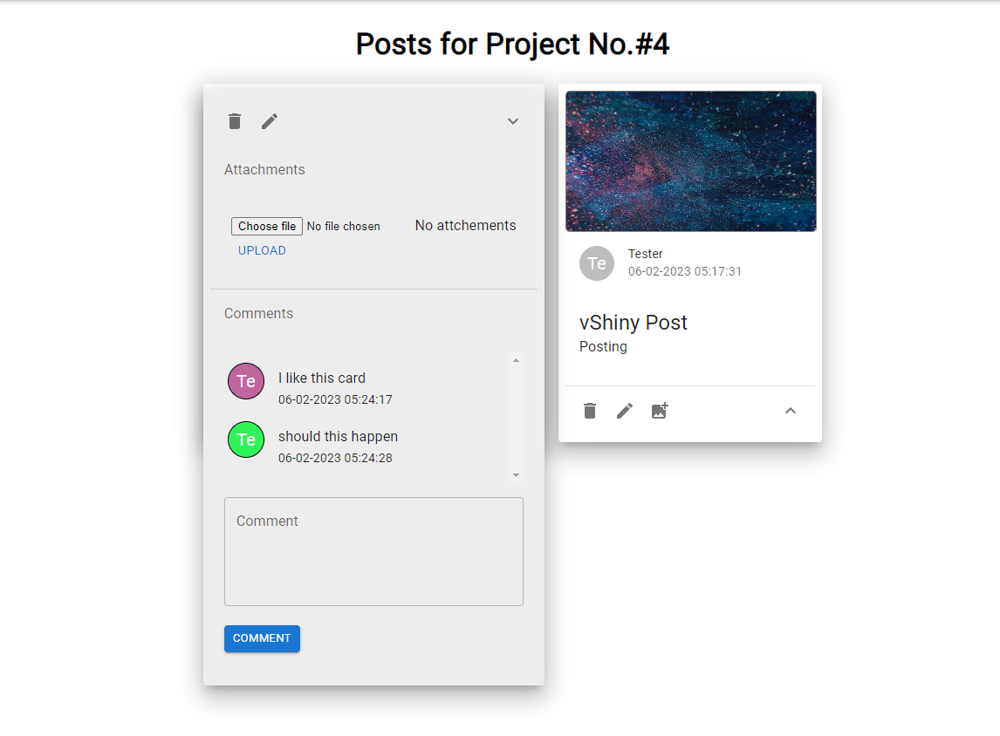
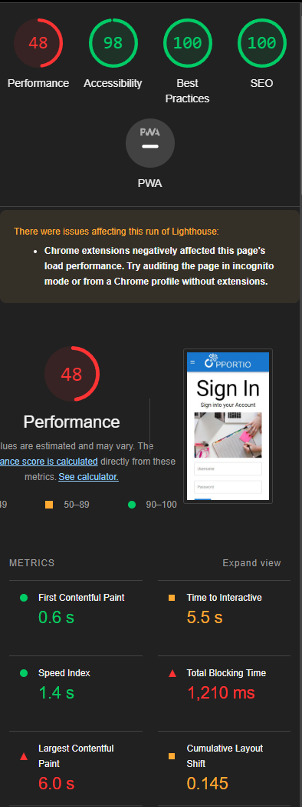

# portfolio-site

# PPortio

## About

### Background

Full stack website made by extending database-backend MVC web application with react this RESTapi backend website was created. The vision behind this project was to create a simple shared kanban board for the completion of projects.

## 

## Technologies

- HTML Formatter: used to format HTML pages and ensure reliability and maintainability of code and features
- Figama: used to create the design of the website and constituent pages
- CSS: used to style HTML pages and create responsive and intuitive UX
- HTML: used to create the components that made up the website
- VS Code: IDE used to develop the site
- Git: used for version control of the website and creating a local repo.
- GitHub: used as a remote repo to store the commits of the project in a place that can be shared.
- GitHub Pages: part of github used to host the website file and create a live project
- Django Rest Framework: used to create api endpoints for backend
- Djago Rest Framework Simple JWT: used to generate JWT tokens for user authentication and login
- Djoser: used to manage authentication backend and management of JWT extension
- Django Cors Headers: used to enable local calls between ui and api
- Pillow: used to allow images to be supported on site
- React: used to create UI and pages
- React Router Dom : used to limit calls to the server and for general navigation in single page application
- Axios - used for calles to server
- Material UI - used to generate consistan themed componants
- PostsgreSQL: used for the database
- Psycopg2: used to interact with database in django
- postman: used to test api enpoints and outputs from requests
- pytest: used to run automated tests in python
- pytest-django: to test django behaviours
- Heroku : used to deploy backed api corresponding to backend branch
- Netlify: used to deploy frontened corresponding to fronend branch

## Design

### Wireframes

- Prelimanry wireframes were completed for the UI of the website however following an agile approach a greater focus was put towards development of features and how the could evolve. additionally as the site is similar to trello and other board sites it was decided to spend more time on features to enable greater UX and by levraging designs users are experienced with I was able to optimise sprint time.

- Below are the wire frames for the site:
  

### Agile

- A kanban sprint approach was used for the managment of the projects to ensure key features would be developed within the timeline of the project. Sprints for the project were 1 week long.

- Below are screeenshots of the kanban board
  

- The font was also selected to stay uniform with the theme as such the default material ui theme was used.

### Images

- Images used in the site are royalty free or have been shared under the open source licence full references and credits below.

### Layout

- The layout of the website uses card components to assist with creating a streamline UX
- The theme of the website components was created with reference to the [Material Design 3](https://m3.material.io) guidelines.

---

## Features

### Navigation

- Navbar

  - The main navcomponant is the side drawbar used to log out and return home but when considering the user flow diagram for site usage and site map the Nav bar resulted in redundancies as users interact with posts and projects directly.

- Cards: Cards used to display key information adn fit with board astetic
  

- Create: Floating action buttons are used to create posts and projects

- Read: Information presented is avalibale to reat and had been fetced with get request

-Update: by selectig the pencil icon cards and projects can be edited partially

-Delete: Deleting casscades all child elements are deleted on delete.

- Image upload: by selecting the upload button feature it is possible to update project image media sections.

- Comments: comments can be posted to a post

- File Upload: files can be attached to a post using the file upload button

- Nice to have features that were not implimented were:
  - Avatar Profile pictures
  - Org Rooms
  - Carosel
  - Static Ad Page
  - Likes

### Pages

All pages are fully responsive on all devices down to a minimum screen width of 320px

- The main page is the projects grid from here the user can view all projects created
- To access the site Auth must be completed first via signing up

  

- given the design of the site most of the pages are used to employ CRUD functiuonality and are not seen as pages by the user

---

## Testing &amp; Validation

- The website was tested in Chrome, Mozilla and Opera browser. All features are supported and page maintained functionality.
- The website was tested on both desktop and mobile devices. The page is responsive to a screen width of 320px
- Dev tools used to emulate all devices from desktop to small mobile range to secure responsiveness.
- The project was tested continiusly duriung development manually the inbult linters in both django and react.
- Automated tests were established to ensure basica functionality of the site such as the CRUD operations and user authentication.

  

- [HTML Validator from w3 schools](https://validator.w3.org) was used to validate formatting of HTML pages. SUCCESS on all pages
- EsLint returned valid for all pages

---

## Bugs

- Serializers: When trying to nest serialisers to create nested objects that can be used by the frontend it resultes in the desired nestign but due to improper configuration of serializer field additional input requirements for the post request. This instance led to the requiremtn to submit objects. After reading documentation applying readonly fields and levraging serializer context the problem was resolved as the user wqas not required to input that information.

  - nested routers: nested routers were implimented using the DRF_Nested library. one drawback was that the deepest level of nesting was only two levels. hence for the site lay out which follows the structure of Project -> Post -> Ancellary (e.g comment,image or file) it was impossible to levrage this library to further nest the features. a solution was developed using props and url parametes to artifically created the nesting from a user point of view , preserving continuity but breaking down the routing to specific paths to achieve this.

  - Deployment: THe deployment of the project was where the largest amount of challenges and time was consumed. Having not deployed a website live before adn using several differet modules these futher contributed to the challenges described below.
  - Procfile: to deploy to heroku a proc file is nessessary to ensure the correct configuration of the backend occours. The procfile revieled the issue I had present in my code with management of static assets. by using the 'whitenoise' library I was able to overcome the static files build error seen.

  - Organization: for a conscise submission i was initally working form one branc with two foulders. This structure meant that my files were hidden from the autometed process that occour during deployment leading to sevral failed builds. I initally linearized my foulder but this did not resolve the issue as it meant multiple technologies were conflicting with teh tests adn the nature could not be determined. To overcome this I created two seprate branches to allow for easier interpetation

  - Heroku Buildpack: The heroku build back for create react app was dpreicated june 22 as such I was recieveing error s whe nusing teh node js build back and ultimately could not deploy the frontend to heroku. I subsequently fiund another place to host the frontend.

  - CORS Permissions: Even though both front and backend were now deployed I was unabel to replicate development server functionality. This was dure to the allowed cors headers. cors was preventing data from being sent from the backend as such prerenderd componants from the front end did not work either. I resolved this bug by adding the frontend api to the approved cors headers list.

  - Netlify Routing: Netlify was preventing rotues bing accessed, by default. the app would load and you could essentially move forward but and CRUD activity would see teh site return a 404 page for routes defined. using teh '\_redirect' file I was able to override this behaviour and produce a fully functional full stack website.
    S

## acing the other html document in the same level as the index.html file and assets folder.

## Deployment

- The project was developed in VS Code to gain experience developing code in a commonly found IDE.
- I created all the basic folders and files I needed for both back and frontend
- project backend was deployed to heroku due to ease of integration with postgres and cloudinary : (https://pportio-server.herokuapp.com/)
- Forntend is deployed in netlify due to support for react deployment: (https://candid-entremet-c964dc.netlify.app/)

---

## Credits

### Persons

- Reuben Ferrante - for constructive feedback and insight on resources to develop the project
- Unsplash Contributors Amit Ranjan et al - for royalty free images used in the site
- CI community - for support throughout the project

### Media

[sign in image](https://unsplash.com/@martenbjork?utm_source=unsplash&utm_medium=referral&utm_content=creditCopyText)

[Default card image](https://www.pexels.com/photo/purple-bokeh-220072/)

[make project](https://unsplash.com/@brookecagle?utm_source=unsplash&utm_medium=referral&utm_content=creditCopyText)

### Technology

Technologies used during the project can be found here:

- [Django](https://www.djangoproject.com/)
- [Django Rest Framework](https://www.django-rest-framework.org/)
- [React Router DOM v6](https://reactrouter.com/en/main)
- [React Hook Forms](https://react-hook-form.com/)
- [Djoser](https://djoser.readthedocs.io/en/latest/index.html)
- [Simple JWT](https://django-rest-framework-simplejwt.readthedocs.io/en/latest/)
- [Axios](https://axios-http.com/docs/intro)
- [MUI V5](https://mui.com/material-ui/material-icons/)

---

## Licences &amp; Copyright

All resources used in this project are under free use policies.
The use of the resources in this project do not infract on the fair uses or terms of use of these resources
